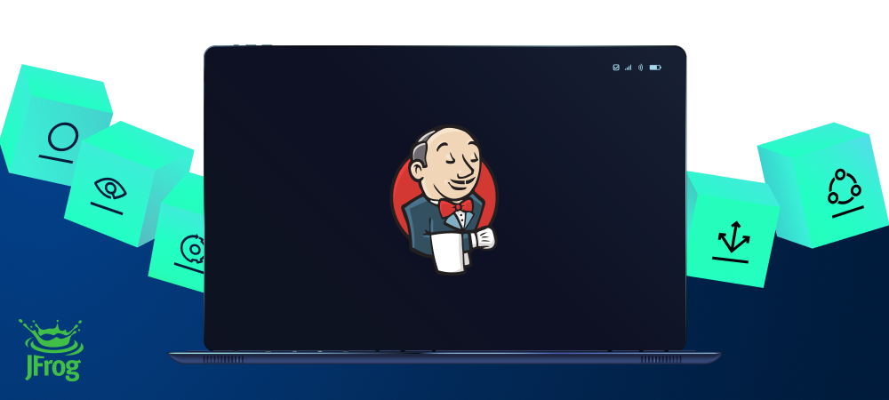

[](#readme)

<div align="center">

# Jenkins Artifactory Plugin

[](https://github.com/jfrog/jenkins-artifactory-plugin/actions/workflows/tests.yml)
[](https://www.jfrog.com/confluence/display/JFROG/Jenkins+Artifactory+Plug-in)

</div>

## General

The plugin integrates Jenkins and Artifactory to publish, resolve, promote and release traceable build artifacts. For
more information, including the release notes, please visit
the [JFrog Artifactory Plugin documentation](https://www.jfrog.com/confluence/display/RTF/Jenkins+Artifactory+Plug-in)

## How to Contribute

JFrog welcomes community contribution through pull requests.

### Important:

The plugin code is stored in two github repositories:
https://github.com/jfrog/jenkins-artifactory-plugin and
https://github.com/jenkinsci/artifactory-plugin

Please make sure to submit pull requests to *https://github.com/jfrog/jenkins-artifactory-plugin* only.

## How to build the plugin code
To build the plugin, please use Maven 3.6.1 or above, with JDK 8, and run:
```console
> mvn clean install
```

## Tests
### Unit tests
To run unit tests execute the following command:
```
> mvn clean test
```

### Integration tests
#### Running integration tests
Before running the integration tests, set the following environment variables.
See [here](https://www.jfrog.com/confluence/display/JFROG/Access+Tokens#AccessTokens-GeneratingAdminTokens) how to generate a Platform Admin Token.

*JENKINS_PLATFORM_URL*<br>
*JENKINS_PLATFORM_USERNAME*<br>
*JENKINS_PLATFORM_ADMIN_TOKEN*<br>
*JENKINS_ARTIFACTORY_DOCKER_PUSH_DOMAIN* (For example, server-docker-local.jfrog.io)<br>
*JENKINS_ARTIFACTORY_DOCKER_PULL_DOMAIN* (For example, server-docker-remote.jfrog.io)<br>
*JENKINS_ARTIFACTORY_DOCKER_PUSH_REPO* (For example, docker-local)<br>
*JENKINS_ARTIFACTORY_DOCKER_PULL_REPO* (For example, docker-remote)<br>
*JENKINS_ARTIFACTORY_DOCKER_HOST* - Optional address of the docker daemon (For example, tcp://127.0.0.1:1234)<br>
*JENKINS_PIP_ENV_INIT* - Optional command to activate pip virtual-environment for tests execution (For example, source /Users/user/jenkins-venv/bin/activate)<br>
*MAVEN_HOME* - The local maven installation path.<br>
*GRADLE_HOME* - The local gradle installation path.<br>

To disable build scan with Xray integration tests, set *JENKINS_XRAY_TEST_ENABLE* to *false*.
Go tests require Go v1.14 or above.

Run the integration tests.
```
> mvn clean verify -DskipITs=false
```
#### Integration tests results and progress
The tests results are printed to the console (standard output) when the tests finish.
Since JUnit however does not indicate which tests are currently running, a file named *tests.log* is created in the current directory, which logs the tests progress.